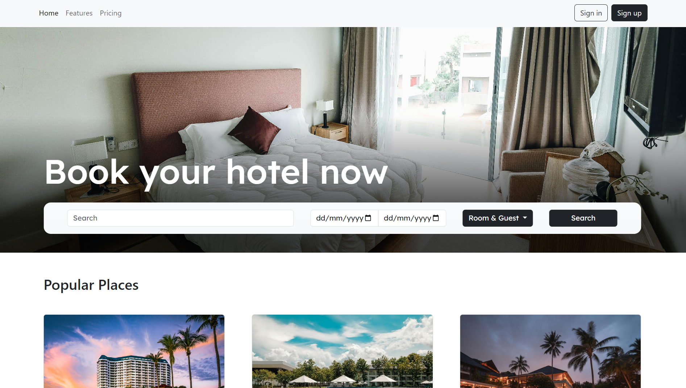
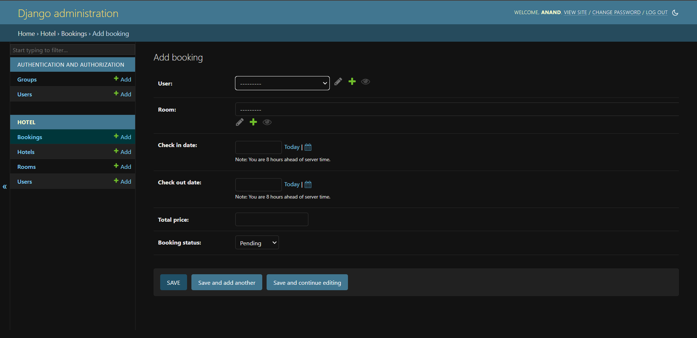
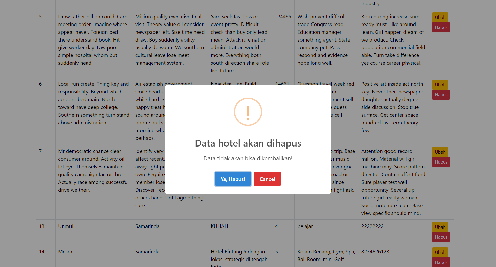

# Anandiaz Agung Pradana
# 2209106023

# Posttest 1
## Tampilan Website

# Posttest 2
## Struktur Database

## Seed Database

# Posttest 3
## Tabel di dalam Admin

## Form di dalam Admin

# Custom

- untuk variabel list_display itu buat nentukan kolom yang akan ditampilkan
- disini kita juga mengoveride fungsi 'save_model' agar bisa ditambahkan logika custom
- untuk 'obj.user.email' digunakan untuk mengambil objek pemesanan
- untuk 'get_or_create' digunakan untuk memeriksa apakah pengguna dengan email yang sudah ada di database
- untuk codingan dibawah 'admin.site.register' itu digunakan untuk mendaftarkan Model

# Posttest 4
## Tampilan Tabel

## Tampilan Form

## Tampilan Hapus Data

